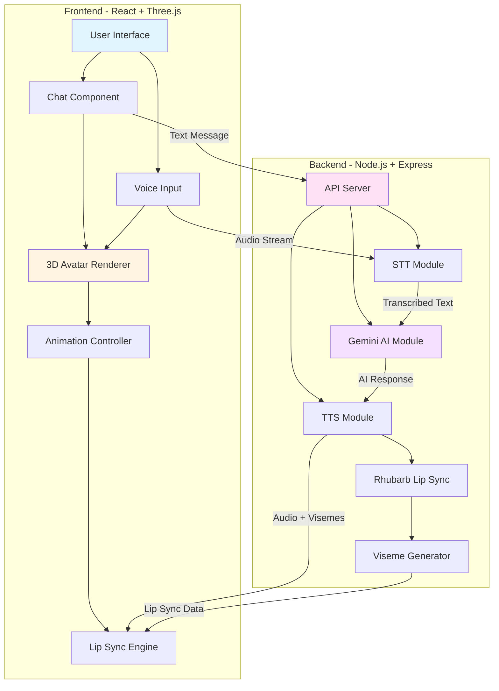

<div align="center">

# 🤖 Aiza Project - AI Personal Teacher

### *An Interactive 3D Avatar Powered by Google Gemini AI*

[](https://opensource.org/licenses/MIT)
[](https://nodejs.org/)
[](https://reactjs.org/)
[](https://threejs.org/)

**A revolutionary talking avatar that can see, hear, speak, and express emotions in real-time conversations.**

[Features](#-features) • [Demo](#-demo) • [Installation](#-installation) • [Usage](#-usage) • [Architecture](#-architecture) • [Customization](#-customization)

</div>

---

## 🌟 Features

<table>
<tr>
<td width="50%">

### 🧠 **AI-Powered Intelligence**
- Natural conversations using Google Gemini AI
- Context-aware responses
- Multi-language support (English, Hindi, Telugu, etc.)
- Customizable personality and teaching style

</td>
<td width="50%">

### 🎭 **Realistic Avatar**
- Expressive facial animations
- Synchronized lip movements
- Emotion-based gestures
- 3D interactive rendering

</td>
</tr>
<tr>
<td width="50%">

### 🎤 **Voice Interaction**
- Speech-to-Text (STT) with Google Cloud
- Text-to-Speech (TTS) with local synthesis
- Real-time audio processing
- Multi-language voice support

</td>
<td width="50%">

### 🎨 **Customizable Experience**
- Modular architecture
- Easy avatar replacement
- Configurable animations
- Extensible plugin system

</td>
</tr>
</table>

---

## 🎬 Demo

> **Experience the Avatar in Action**

The avatar can:
- 💬 Engage in natural conversations
- 🗣️ Speak with synchronized lip movements
- 😊 Express emotions through facial expressions
- 🎯 Teach and explain complex topics
- 🌍 Communicate in multiple languages

---

## 🏗️ Architecture



### 📊 System Workflow

#### **Text Input Flow**
```
User Input (Text) → Gemini AI Processing → Response Generation 
    → Local TTS → Rhubarb Lip Sync → Avatar Animation
```

#### **Voice Input Flow**
```
User Input (Audio) → Speech-to-Text → Gemini AI Processing 
    → Response Generation → Local TTS → Rhubarb Lip Sync → Avatar Animation
```

---

## 🚀 Installation

### Prerequisites

Before you begin, ensure you have the following installed:

| Requirement | Version | Download Link |
|------------|---------|---------------|
| **Node.js** | v14+ | [nodejs.org](https://nodejs.org/) |
| **Yarn** | Latest | [yarnpkg.com](https://yarnpkg.com/) |
| **FFmpeg** | Latest | [Mac](https://formulae.brew.sh/formula/ffmpeg) \| [Linux](https://ffmpeg.org/download.html) \| [Windows](https://ffmpeg.org/download.html) |
| **Gemini API Key** | - | [Google AI Studio](https://aistudio.google.com/) |
| **Rhubarb Lip-Sync** | Latest | [GitHub Releases](https://github.com/DanielSWolf/rhubarb-lip-sync/releases) |

### Step-by-Step Setup

#### 1️⃣ **Clone the Repository**

```bash
git clone https://github.com/siddugarlapati/Avatar.git
cd Avatar
```

#### 2️⃣ **Install Dependencies**

```bash
# Install all dependencies for the monorepo
yarn install
```

#### 3️⃣ **Setup Rhubarb Lip-Sync**

```bash
# Create bin directory in backend
mkdir -p apps/backend/bin

# Download Rhubarb from: https://github.com/DanielSWolf/rhubarb-lip-sync/releases
# Extract and move all contents to apps/backend/bin/
```

#### 4️⃣ **Configure Environment Variables**

Create a `.env` file in `apps/backend/`:

```env
# Google Gemini API (Required)
GEMINI_API_KEY=your_gemini_api_key_here

# Optional: Google Cloud Speech-to-Text
# GOOGLE_APPLICATION_CREDENTIALS=path_to_service_account.json

# Optional: OpenAI (Alternative to Gemini)
# OPENAI_API_KEY=your_openai_api_key_here
# OPENAI_MODEL=gpt-3.5-turbo
```

> 🔑 **Get your Gemini API key:** Visit [Google AI Studio](https://aistudio.google.com/) and create a new API key.

#### 5️⃣ **Run the Application**

```bash
# Start both frontend and backend
yarn dev
```

The application will be available at:
- **Frontend:** [http://localhost:5173](http://localhost:5173)
- **Backend:** [http://localhost:3000](http://localhost:3000)

---

## 📖 Usage

### Basic Interaction

1. **Open the application** in your browser at `http://localhost:5173`
2. **Type a message** in the chat interface or **click the microphone** to speak
3. **Watch the avatar respond** with synchronized speech and animations

### API Endpoints

| Endpoint | Method | Description |
|----------|--------|-------------|
| `/tts` | POST | Text-to-Speech with avatar animations |
| `/sts` | POST | Speech-to-Text with avatar response |
| `/voices` | GET | Get available TTS voices |

### Example API Request

```javascript
// Text-to-Speech Request
fetch('http://localhost:3000/tts', {
  method: 'POST',
  headers: { 'Content-Type': 'application/json' },
  body: JSON.stringify({
    message: 'Hello! How can I help you today?',
    language: 'english'
  })
})
```

---

## 📁 Project Structure

```
adam-project/
├── apps/
│   ├── backend/                 # Node.js Express Server
│   │   ├── modules/            # Core modules
│   │   │   ├── gemini.mjs     # Gemini AI integration
│   │   │   ├── google-tts.mjs # Text-to-Speech
│   │   │   ├── google-stt.mjs # Speech-to-Text
│   │   │   └── lip-sync.mjs   # Rhubarb Lip Sync
│   │   ├── bin/               # Rhubarb executable
│   │   ├── audios/            # Generated audio files
│   │   └── server.js          # Main server file
│   │
│   └── frontend/               # React + Three.js Frontend
│       ├── src/
│       │   ├── components/    # React components
│       │   ├── hooks/         # Custom React hooks
│       │   └── constants/     # Configuration files
│       └── public/
│           ├── models/        # 3D avatar models
│           └── animations/    # Avatar animations
│
├── AVATAR_CREATION_GUIDE.md   # Guide for custom avatars
├── MORPH_TARGETS_GUIDE.md     # Facial animation guide
└── README.md                   # This file
```

---

## 🎨 Customization

### Customize Avatar Personality

Edit `apps/backend/modules/gemini.mjs` to modify the avatar's behavior:

```javascript
const systemPrompt = `
You are Adam, a friendly and knowledgeable AI teacher.
Your personality: Patient, encouraging, and enthusiastic.
Your teaching style: Clear explanations with real-world examples.
`;
```

### Replace the Avatar Model

1. Create or download a GLB avatar with required morph targets
2. Place it in `apps/frontend/public/models/avatar.glb`
3. See [AVATAR_CREATION_GUIDE.md](AVATAR_CREATION_GUIDE.md) for detailed instructions

### Add Custom Animations

1. Export animations as FBX or GLB format
2. Place in `apps/frontend/public/animations/`
3. Update animation references in `Avatar.jsx`

---

## 🛠️ Technology Stack

<table>
<tr>
<td align="center" width="25%">

<br><strong>React</strong>
<br>UI Framework
</td>
<td align="center" width="25%">

<br><strong>Three.js</strong>
<br>3D Rendering
</td>
<td align="center" width="25%">

<br><strong>Node.js</strong>
<br>Backend Server
</td>
<td align="center" width="25%">

<br><strong>Gemini AI</strong>
<br>Language Model
</td>
</tr>
</table>

### Key Dependencies

**Frontend:**
- `@react-three/fiber` - React renderer for Three.js
- `@react-three/drei` - Useful helpers for React Three Fiber
- `three` - 3D graphics library

**Backend:**
- `@google/generative-ai` - Gemini AI SDK
- `@google-cloud/text-to-speech` - Google TTS
- `@google-cloud/speech` - Google STT
- `express` - Web server framework

---

## 🤝 Contributing

Contributions are welcome! Here's how you can help:

1. **Fork the repository**
2. **Create a feature branch** (`git checkout -b feature/AmazingFeature`)
3. **Commit your changes** (`git commit -m 'Add some AmazingFeature'`)
4. **Push to the branch** (`git push origin feature/AmazingFeature`)
5. **Open a Pull Request**

---

## 📝 License

This project is licensed under the **MIT License** - see the [LICENSE](LICENSE) file for details.

---

## 🙏 Acknowledgments

- **[Google Gemini](https://ai.google.dev/)** - AI language model
- **[Rhubarb Lip-Sync](https://github.com/DanielSWolf/rhubarb-lip-sync)** - Lip synchronization
- **[Ready Player Me](https://readyplayer.me/)** - Avatar creation platform
- **[Mixamo](https://www.mixamo.com/)** - Animation library
- **[Three.js](https://threejs.org/)** - 3D graphics library

---

## 📚 Additional Resources

- 📖 [Avatar Creation Guide](AVATAR_CREATION_GUIDE.md)
- 🎭 [Morph Targets Guide](MORPH_TARGETS_GUIDE.md)
- ⚙️ [Setup Instructions](SETUP_INSTRUCTIONS.md)

---

## 📧 Support

If you encounter any issues or have questions:

1. Check the [documentation](SETUP_INSTRUCTIONS.md)
2. Search [existing issues](https://github.com/siddugarlapati/Avatar/issues)
3. Create a [new issue](https://github.com/siddugarlapati/Avatar/issues/new)

---

<div align="center">

**Made with ❤️ by the Adam Project Team**

⭐ Star this repository if you find it helpful!

</div>
